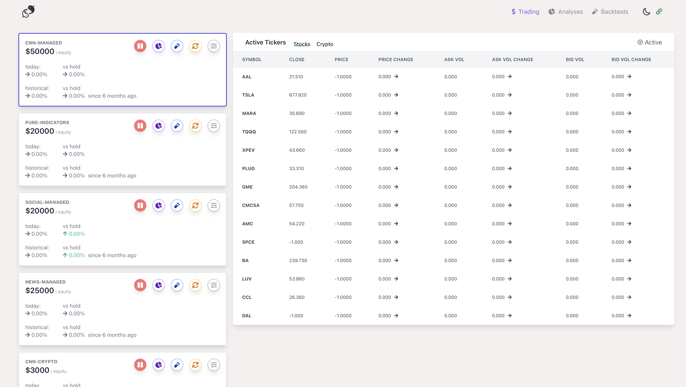
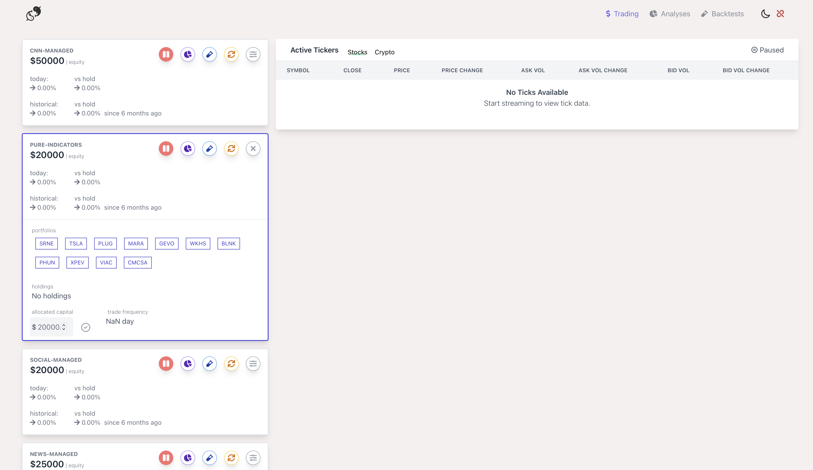

# Welcome to Koi

## Interface
<p float="left">
    
    
</p>

## Configuration


### Env Setup

```
PHONE=[] # optional - notifies you when transactions occur (macOS + iMessage only)

CRYPTO_EXCHANGE=[your desired crypto exchange] # can be one of 'robinhood' | 'coinbase' | 'kraken' | 'binance'
CRYPTO_SANDBOX=[True|False] # determines if live trading is performed

# Robinhood options: only required if using robinhood as your crypto exchange
RH_LOGIN=[your robinhood login]
RH_PASS=[your robinhood password]

# Coinbase options: only required if using coinbase as your crypto exchange
COINBASE_KEY=[your coinbase api key] 
COINBASE_PASSPHRASE=[your coinbase api passphrase]
COINBASE_SECRET=[your coinbase api secret]

# Binance options: only required if using binance as your crypto exchange
BINANCE_KEY=[your binance api key]
BINANCE_SECRET=[your binance api secret]

# Kraken options: only required if using kraken as your crypto exchange
KRAKEN_API_KEY=[your kraken api key]
KRAKEN_API_SECRET=[your kraken api secret]

# Required: Your Interactive Brokers Details
IB_ACCOUNT=[your ib account id]
IB_USERNAME=[your ib username]
IB_PORT=[trader workstation / ib gateway port] # usually 7496 for live, 7497 for paper
```


### Application Structure

*todo*

### Strategy Configuration

*todo*


## Running
To start Koi after you have your desired configuration and have installed the required npm/pip packages, simply run

```
yarn build && python3 app.py 
```

in your terminal.

If you haven't made any changes to the UI code (and have previously ran `yarn build`), you can just run

```
python3 app.py
```


